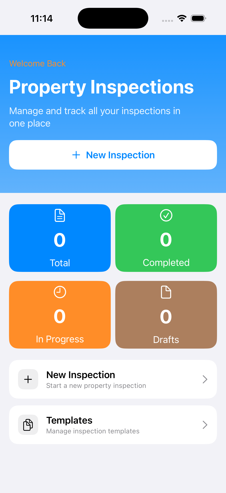
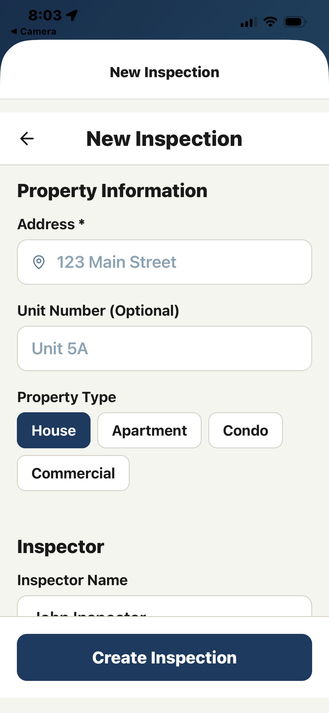

# 🏠 Property Manager (Swift)

  
  
  
  
  

> A modern, native iOS property inspection app built with **SwiftUI** and **SwiftData** — designed for property managers, landlords, and inspectors who need fast, offline-first, structured inspections with rich media and professional PDF reports.

---

## 📱 Screenshots

| Home | New Inspection | Room Checklist | PDF Report |
|------|---------------|----------------|------------|
<<<<<<< HEAD
|  |  |  |  |
=======
|  |  |  |  |
>>>>>>> 6e401a177c695dc88101a2e77a4fdd45331395c1

> *(You can replace these with real images later — this layout renders nicely on GitHub.)*

---

## ✨ What Property Manager Does

**Property Manager** helps you complete better inspections, faster.

### Core Capabilities

- ✅ **Offline-first inspections** — work anywhere, sync later (if you add cloud later)
- 📸 **In-app camera** — capture property conditions in context  
- 🎙️ **Voice notes** — speak instead of type when you're on-site  
- 🧾 **Room-by-room checklists** — structured, repeatable inspections  
- 📍 **Location-aware records** — GPS-tagged inspection data  
- 📄 **Professional PDF reports** — generate, store, and share  
- 📊 **Live dashboard** — see Total, Completed, In Progress, and Draft inspections at a glance  
- 🎨 **Native iOS design** — built to follow Apple’s Human Interface Guidelines (HIG)

---

## 🏗️ Architecture

This project follows a **SwiftUI + SwiftData + ViewModel** architecture (a SwiftUI-friendly interpretation of MVC/MVVM).

